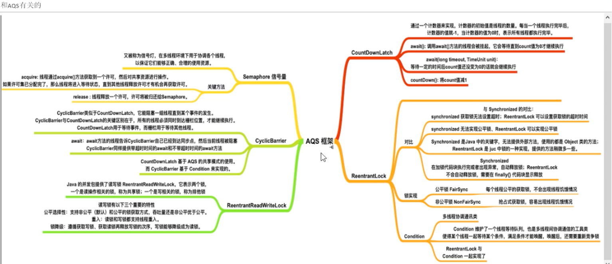

### AQS思想

设计模式：模版设计模式，需要子类实现，否则就会报错

### Node封装的就是一个一个的线程

对应分析图

B节点入队完成 C节点

B和C客户因为park停在这了 自旋 java.util.concurrent.locks.AbstractQueuedSynchronizer.acquireQueued

我们lock.unlock()进行解锁状态

解锁B节点 FIFO先进先出

B节点抢占成功会把队列中的头节点干掉，自己滞空，成为新的头节点

如图

总结

队列中再抢抢

A调用unLock方法会唤醒阻塞中的B

