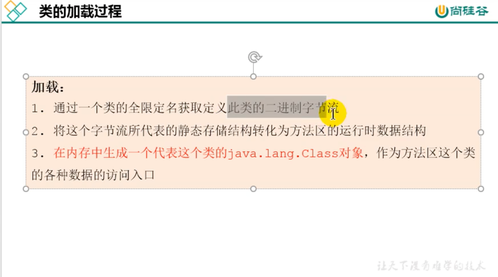

##类加载器和加载器子系统

加载过程图

加载（整个加载过程中的一部分）

链接

初始化

number输出：10
类加载器

类加载器层级关系

用户自定义的类使用的是系统加载器加载
系统的核心类库都是使用的是引导类加载器加载
Bootstrap ClassLoader  
我们通过classLoader是获取不到的，获取到的是null

自定义加载器

###双亲委派机制

比如我们自定义一个类为什么是appClassLoader加载的呢，实际上是走了一波双亲委派再回来的，先去问扩展加载器，扩展加载
器发现自己有父类，那么就委托给引导类加载器，引导类加载器发现这个类不是属于他加载包范围，于是就让子类扩展加载器自己加载
扩展加载器发现也不是加载包下的，于是就让应用加载器自己加载，所以打印出来的加载器就是应用加载器

