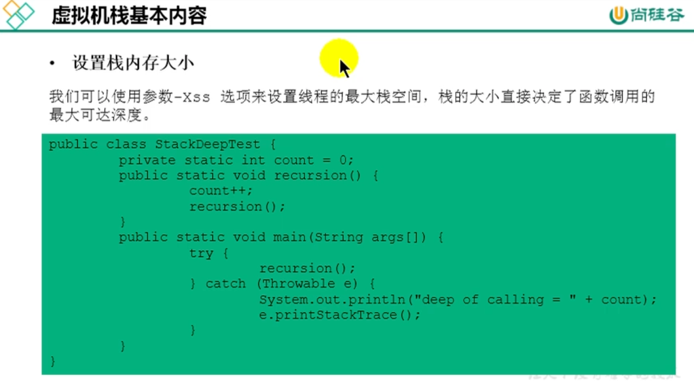
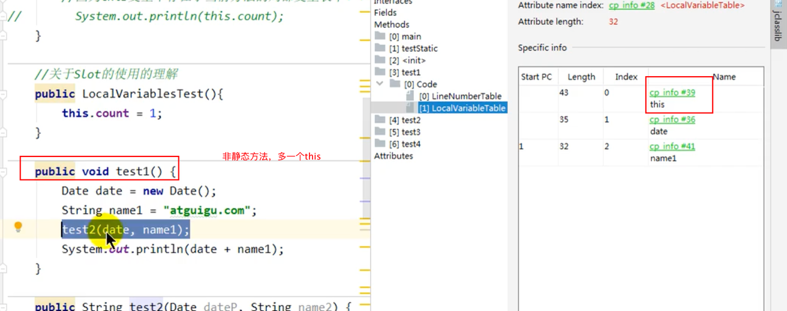

线程与操作系统的关系

程序寄存器
对物理寄存器的模拟

pc寄存器是线程私有的，当我们的cpu切换会回来的时候我们要知道我们执行到哪儿了

虚拟机栈

一个栈真就对应一个方法

虚拟机栈有OOM，但是没有GC

2.栈的存储单位

3.栈运行原理
    方法的结束方式：1.return正常结束，2.抛出异常

栈帧-局部变量表，方法里面我们定义的所有的信息

Slot
为什么静态方法里面不存在this呢，因为它的局部变量表里面没有维护

关于slot的理解

slot的重复利用

