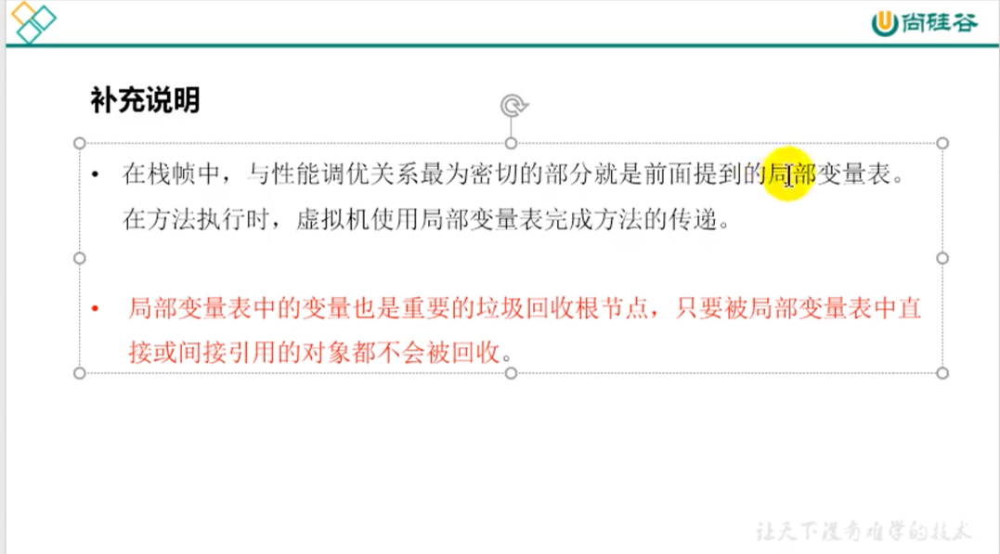
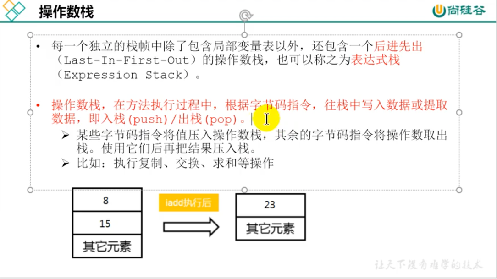
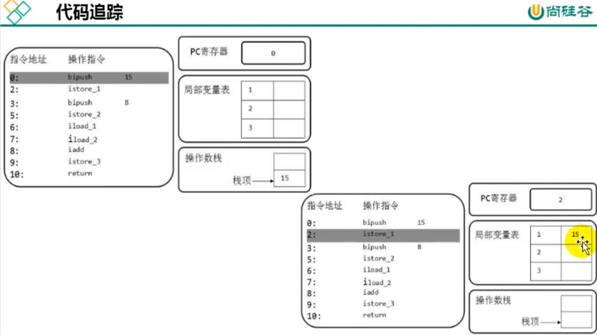
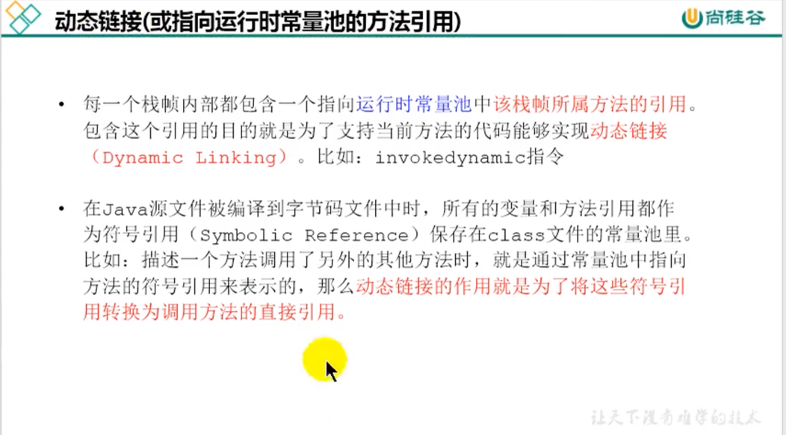
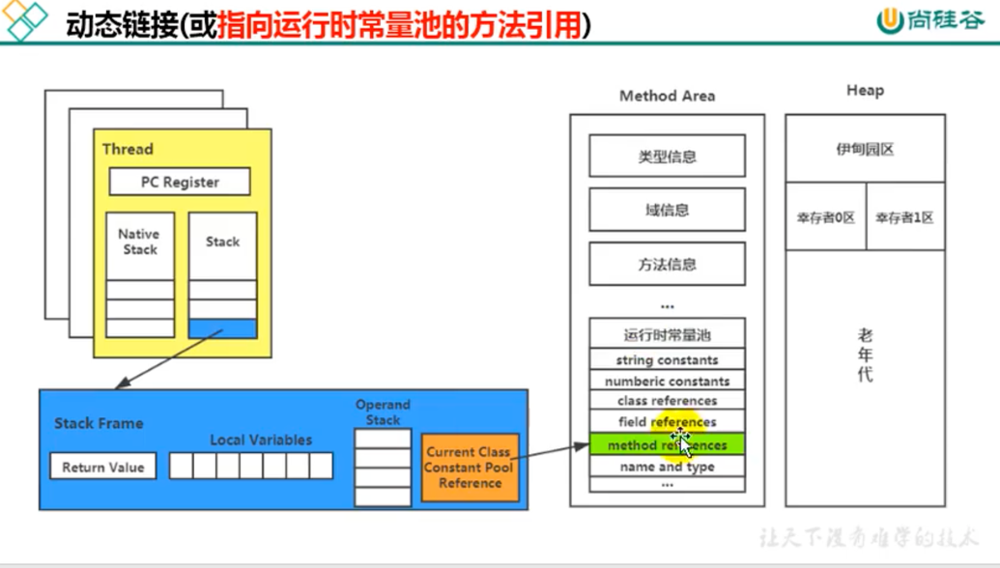
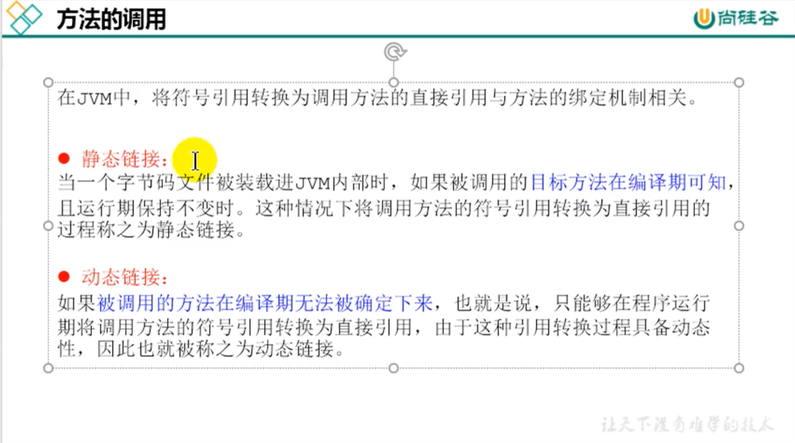

类变量和局部变量的区别
---

####类变量：
linking的prepare阶段给类变量默认赋值，-->initial阶段给类变量显示的赋值
既静态代码块赋值

####实例变量
    随着对象的创建在堆空间分配实例变量空间，并进行默认赋值
####局部变量
    在使用前必须显示的赋值，否则编译不通过

----

###操作数栈

####代码追踪

#####栈帧
最重要的两个结构：局部变量表：存储数据，操作数栈：记录，求和，交换，数组实现但又是栈的特点，ipush就是
往操作数栈里面添加数据

----

####方法调用

   #####晚期绑定，动态链接，编译期间我们无法确定的对象，如接口，多态
   #####早期绑定，构造器，调用父类的方法，能提前确定的

