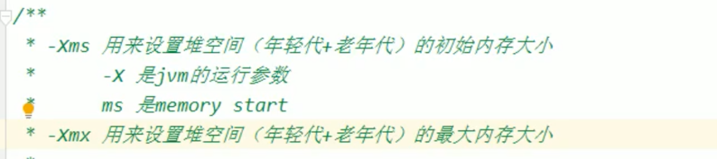

####方法重写的本质

####虚方法表
主要是为了解决方法重写依次向上找对应方法的问题

####方法返回地址

####本地方法

###本地方法栈

###Jvm学习路线即将

##堆

    一个进程就是一个虚拟机实例，每一个实例都有一个堆空间

方法一出栈，我们的堆里面的对象就会被回收吗？实际上不是的
，当内存不足的时候触发GC的时候才会去判断一个对象会不会被回收

###堆的核心概述

#####设置堆内存空间大小和OOM

