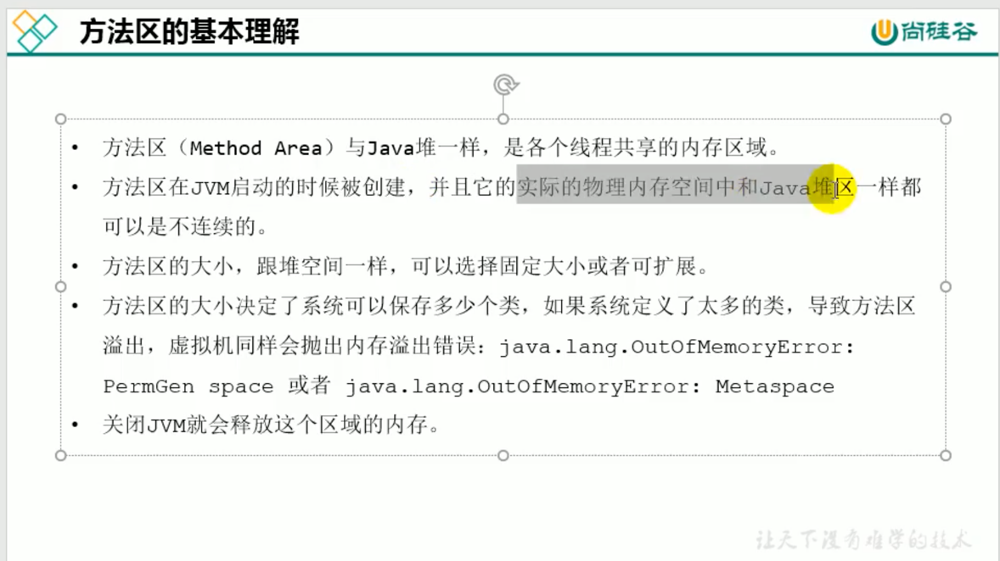

###堆部分参数设置

####对象分配过程

~~~
Eden区满的时候才会触发回收，也就是yongGC,此时也会回收幸存者s1，s2，而s1，s2
满的时候不会触发yongGC
~~~

####回收图解

Minor GC==YongGC

Major GC== Full GC

MajorGC

Full GC

####堆空间分代思想

####内存分配策略

非TLAB会自动加锁保证原子性
位于堆区域的Eden区，每个线程私有

####堆空间的常用参数

方法出栈，对象不会立即回收，等待GC回收

堆内存是分配对象的唯一选择吗？

栈上分配

发生了逃逸，有可能被其他的方法调用

如何判断是否发生了逃逸分析，我们就看new的对象是否有可能
在方法外调用
jdk7之后默认开启了逃逸分析
 

因为没地方用这个对象，然后就会把聚合量拆为标量

栈堆方法区的关系

##方法区的理解

元空间就是方法区的一个具体实现
jdk8之前溢出报错和jdk8之后是不一样的，以前叫永久代，现在叫元空间
永久带之前使用的是堆内存，现在使用的是直接内存，也就是本地内存

