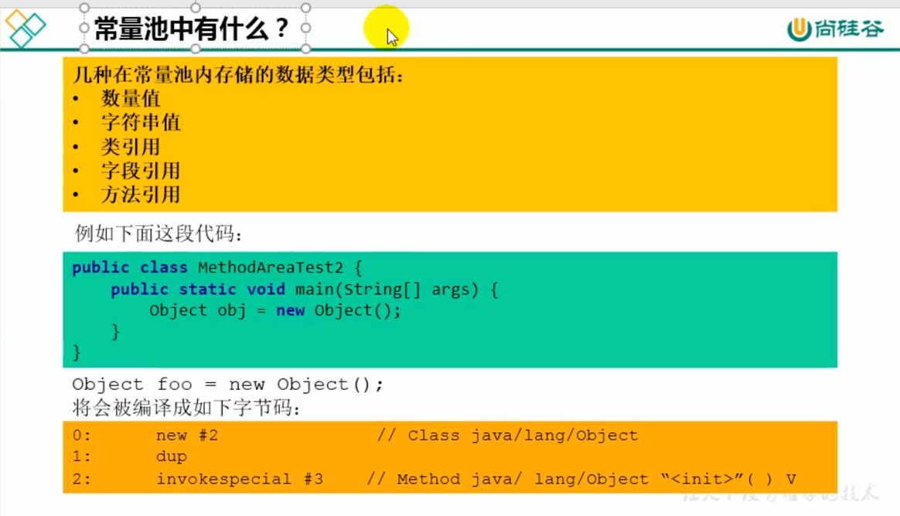

###方法区值的设置

MetaspaceSize调整会触发fullGC
如何解决OOM

方法区的结构
类定义的信息

方法区中的类型信息

####类型信息：实现了哪些接口，继承了哪些类，包，泛型

域信息

方法信息，记录方法的操作数深度，局部变量表长度，参数个数

static final xx的常量在编译的时候就已经赋值了

##运行时常量池和常量池

javap -v -p xxx.class
我们一个类可能会引入了太多的其他类，如果都放在一起的话文件会非常大，所以我们在
常量池里面维护符号引用

###运行时常量池

虚拟机栈，PC，方法区的关系

方法去演进细节

内存我们先分给虚拟机，相当于虚拟机它在自己的王国里面自己主宰自己分配

