###String相关

####String的基本特性

jdk8是char类型数组，jdk9是byte[]数组
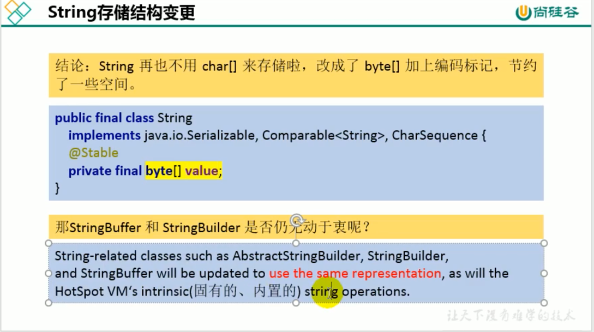
####String的不可变性
    底层数组，确定后长度就固定了，不可变性，有改变一定是重新去字符串常量池中创造
一个新的一个
StringTable的结构：hashTable 数组+链表
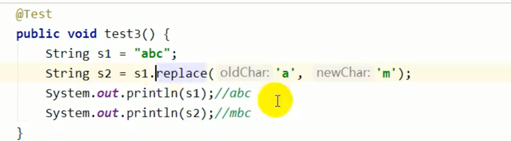
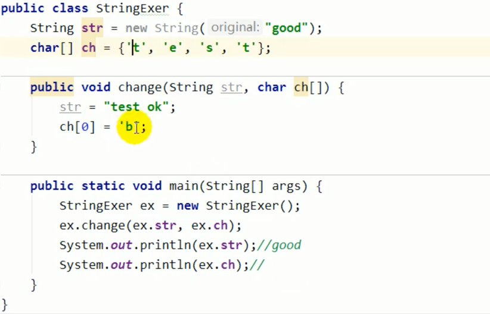
字符串常量池不会放重复的字符
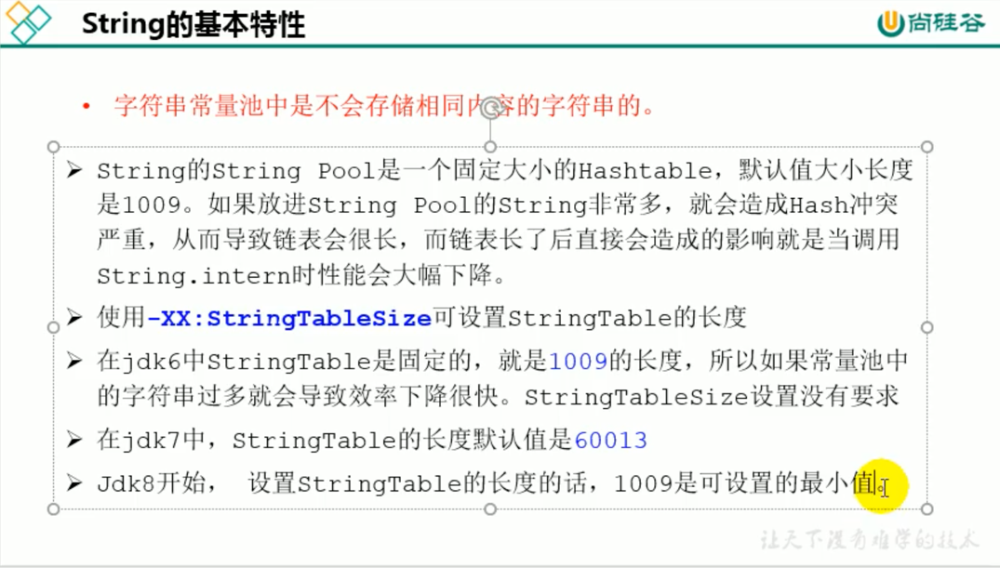
字符串常量池的长度与性能正相关
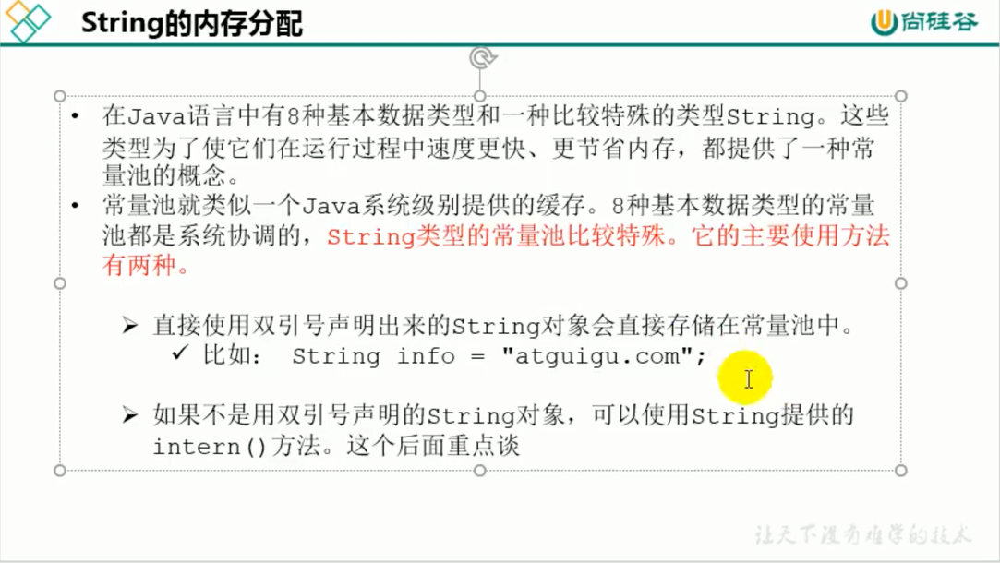
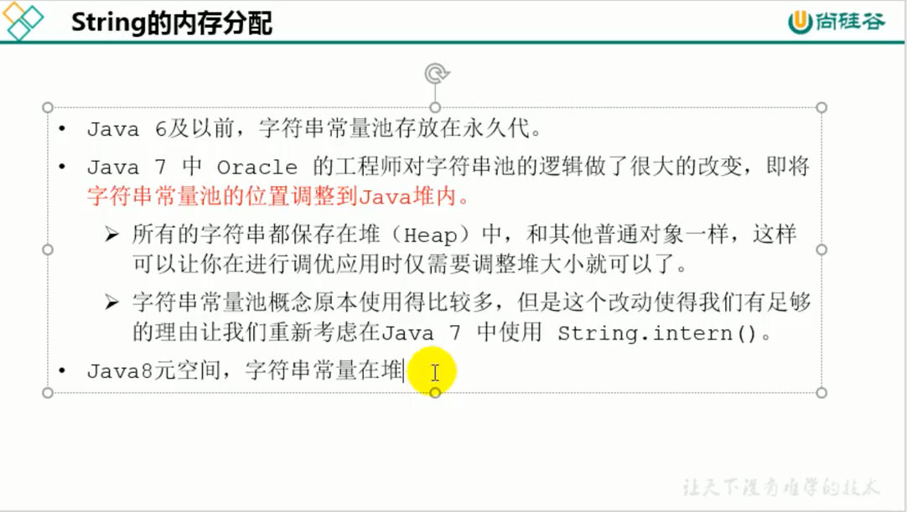
####StringTable为什么要从栈移到堆空间
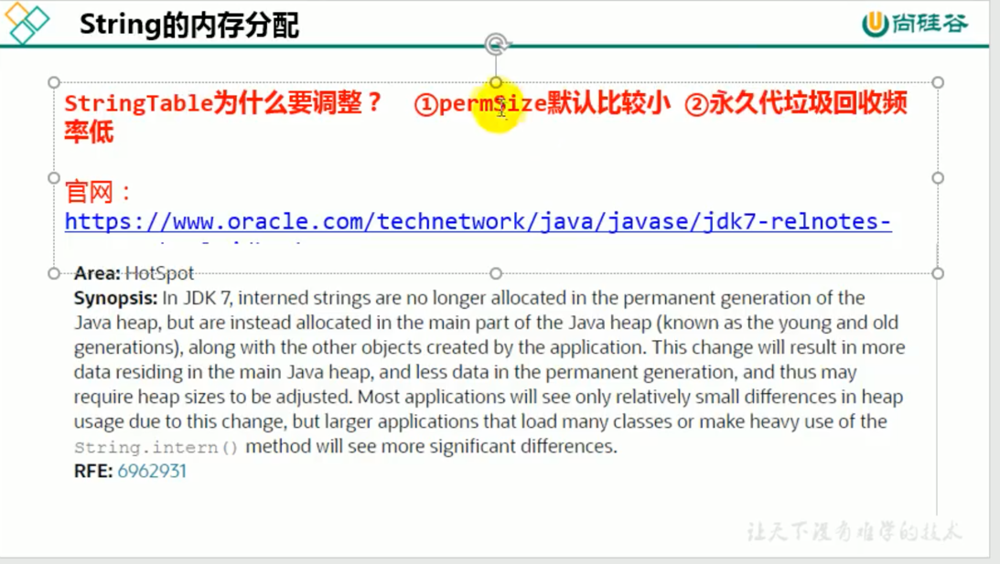
字符串操作不存在就会加入到常量池
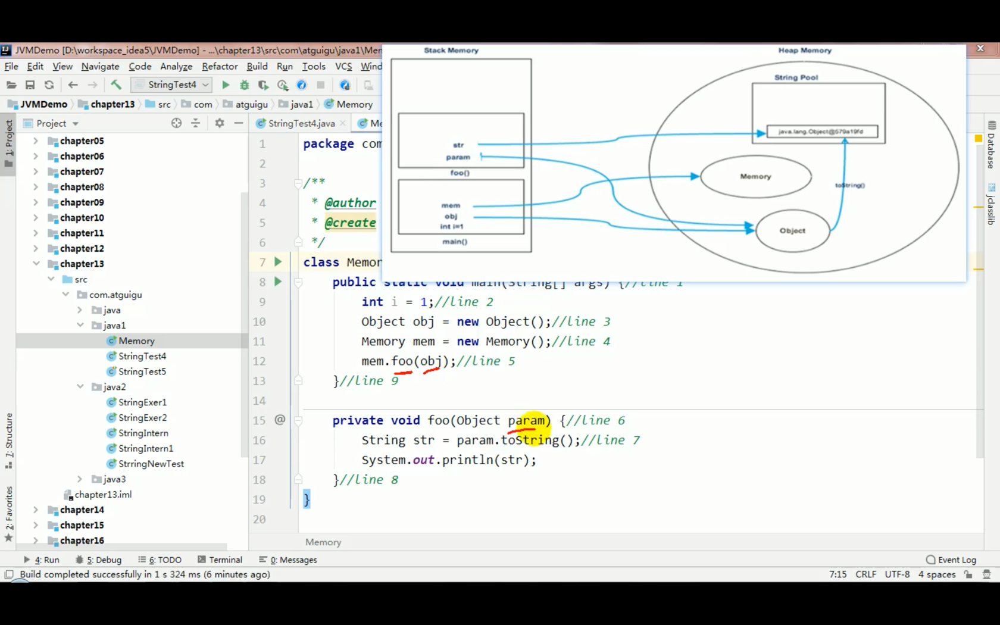

####字符串的拼接操作
如果拼接的是常量会触发编译器优化，生成的结果位于字符串常量池
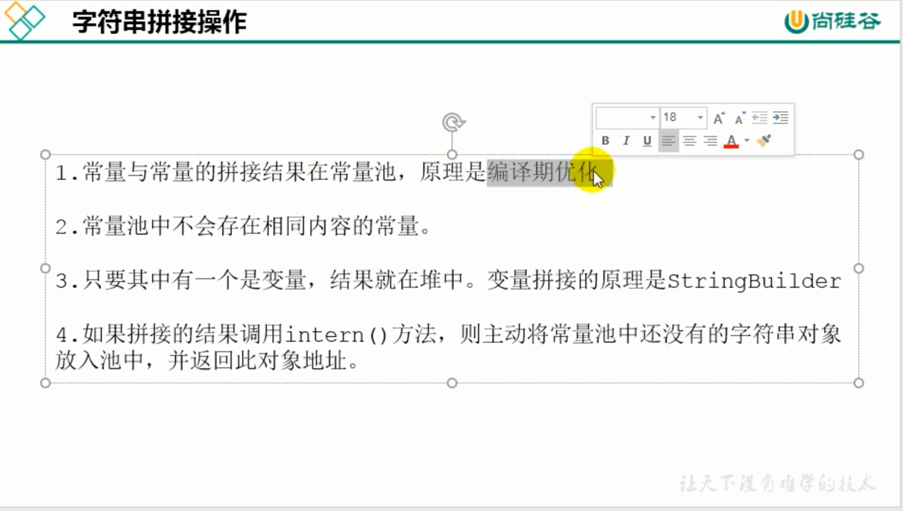
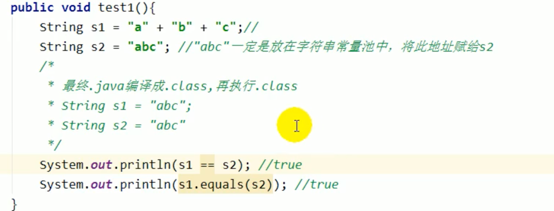
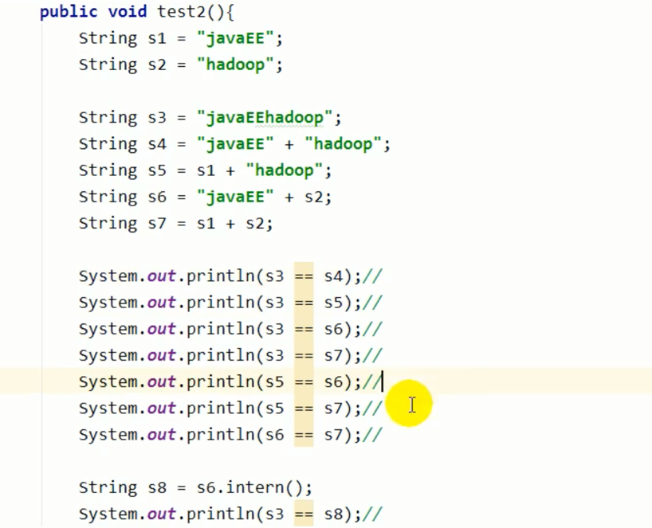
只要拼接的时候有一个是变量，则相当于在堆空间中new一个对象
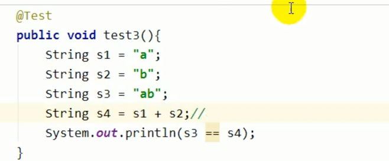
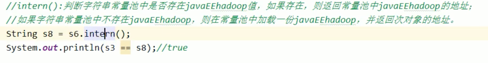
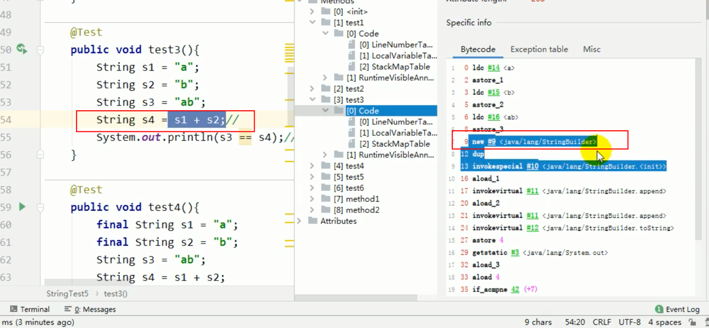
字符串变量相加是通过StringBuilder来实现的
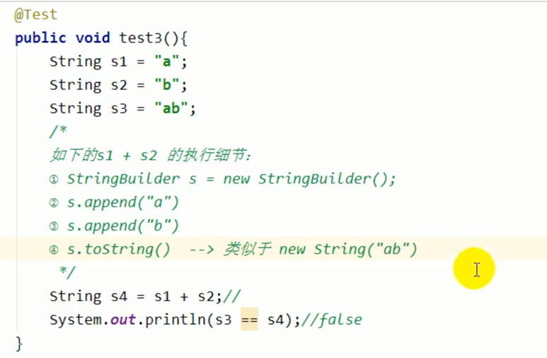

