###字符串拼接操作
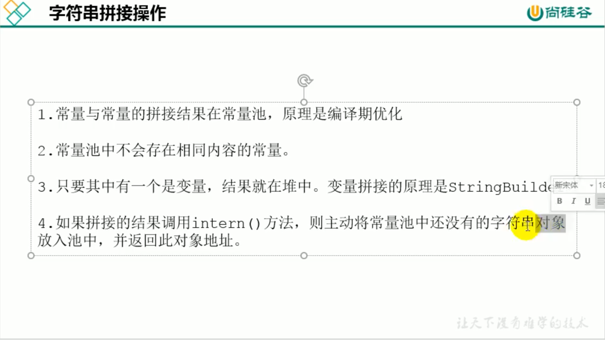

####String左右两边有变量的情况
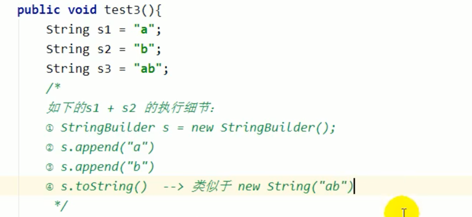
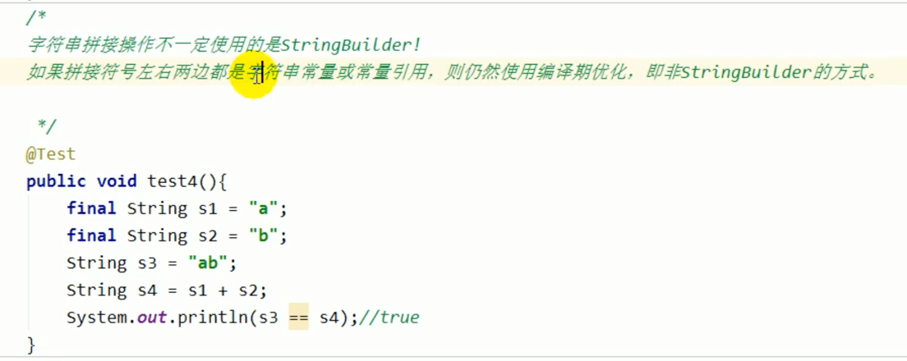

###直接使用+和使用StringBuilder的速度大概是几百倍的差距
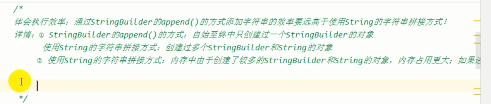
改进的空间，提前确定StringBUilder(8)构造方法的大小，减少拷贝扩容

###Intern()的使用
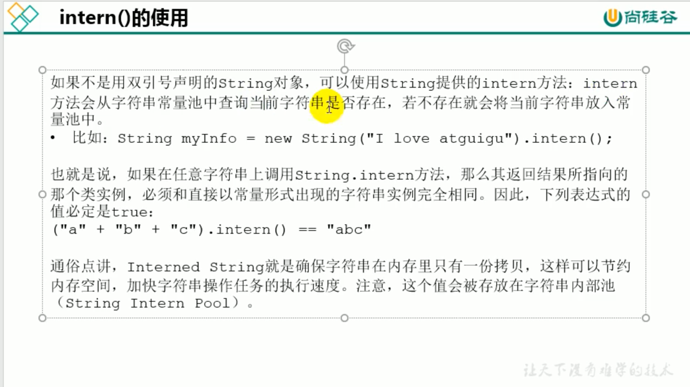
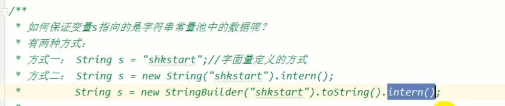
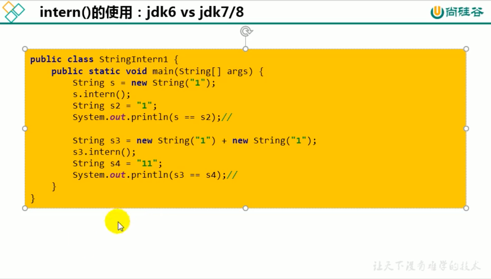
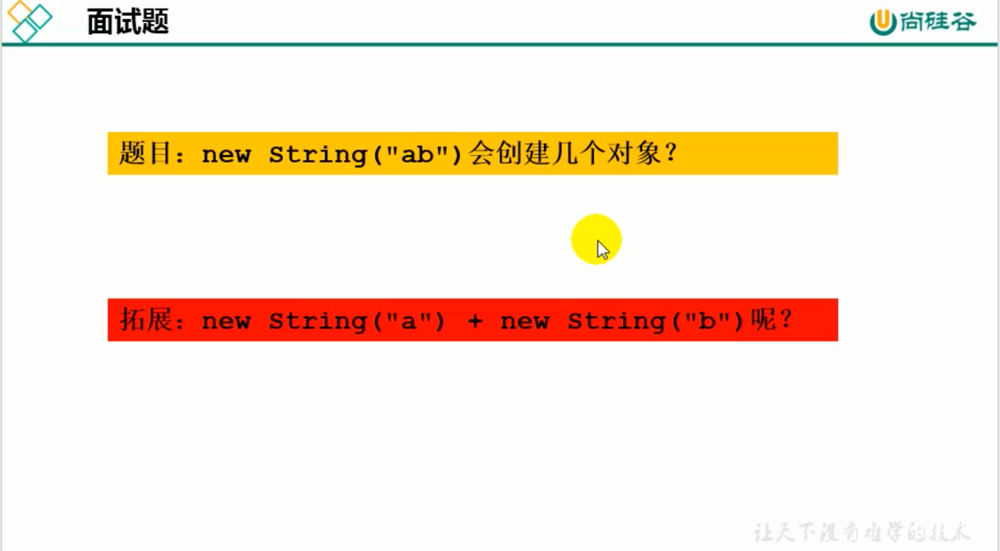
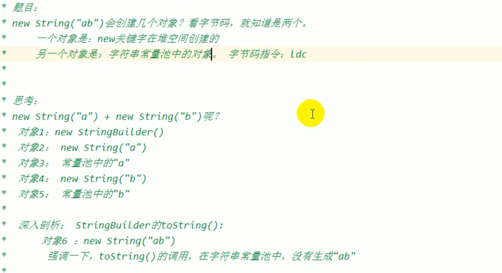
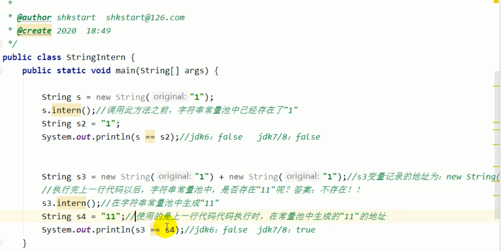
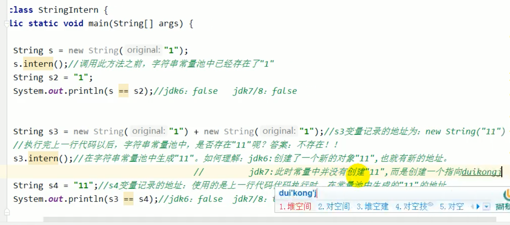
###intern常量池指向堆空间，一句话，jdk8中s.intern()是没有在字符串常量池
中创建的，只是把引用指向了我们的堆空间
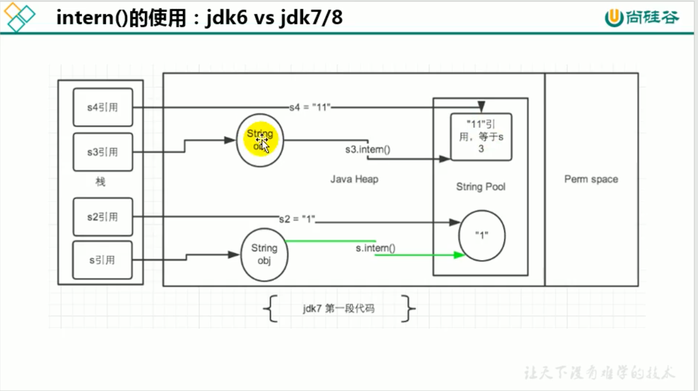
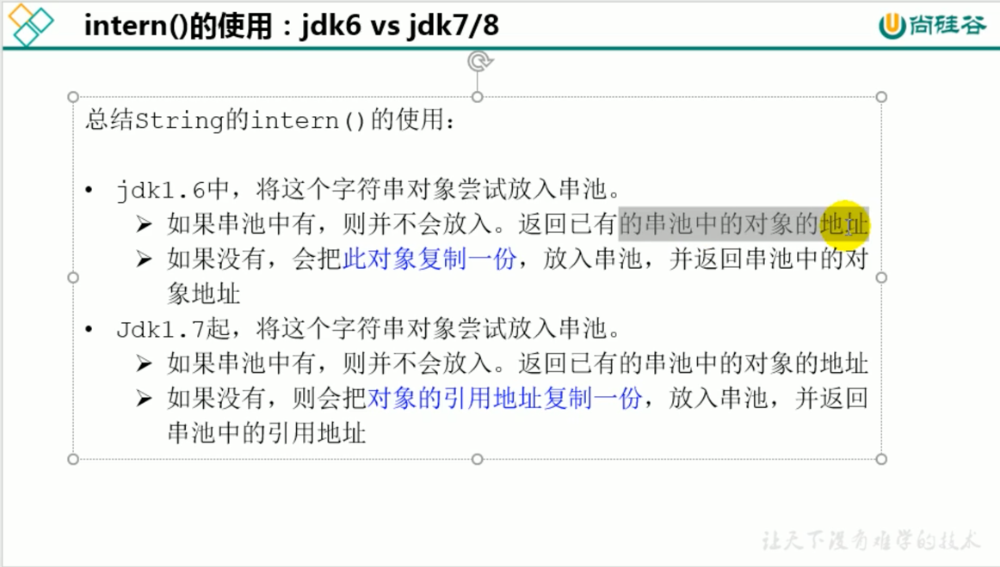
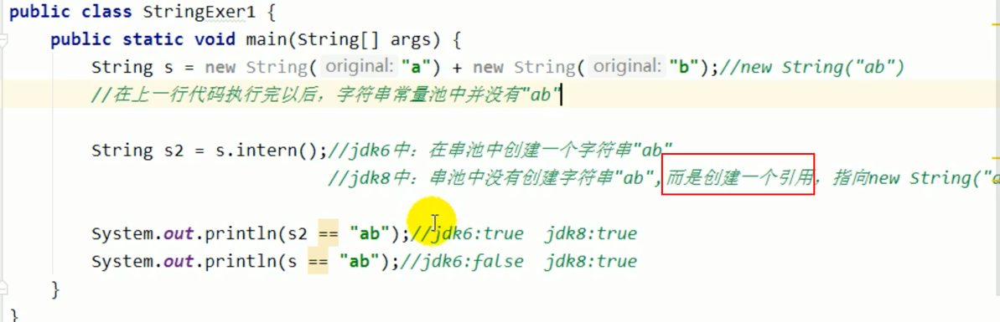
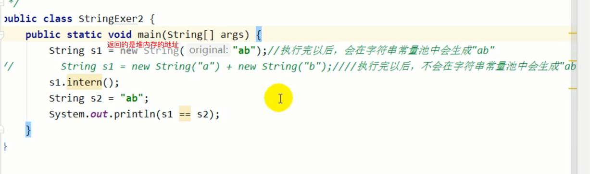
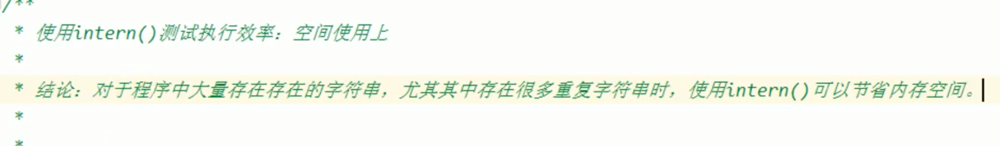
####使用常量池重的字符串而不是使用堆空间的，堆空间的没有引用后期会被回收，从而减少了内存的使用

###堆空间内存去重
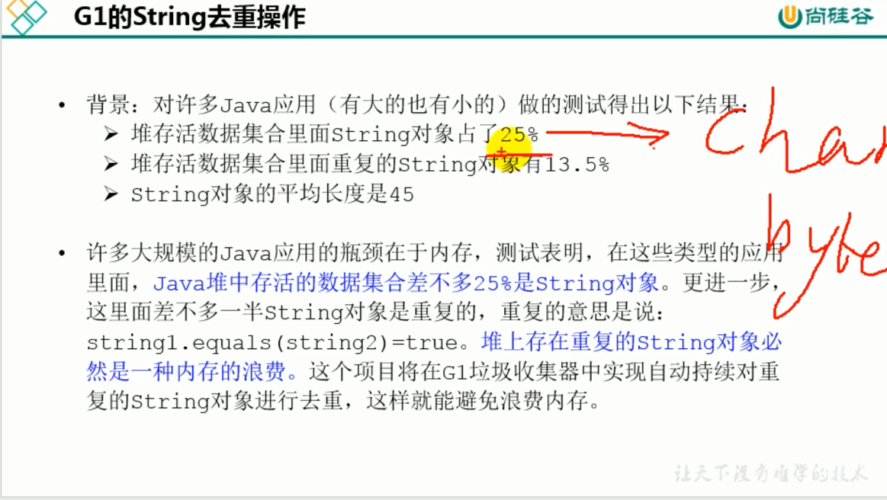
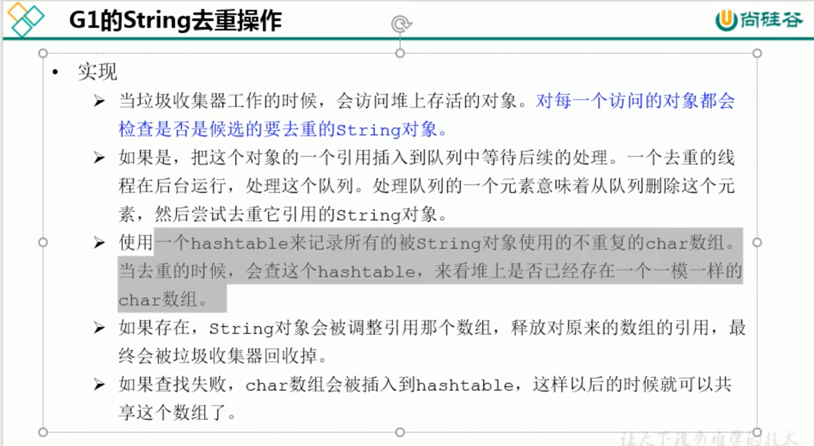