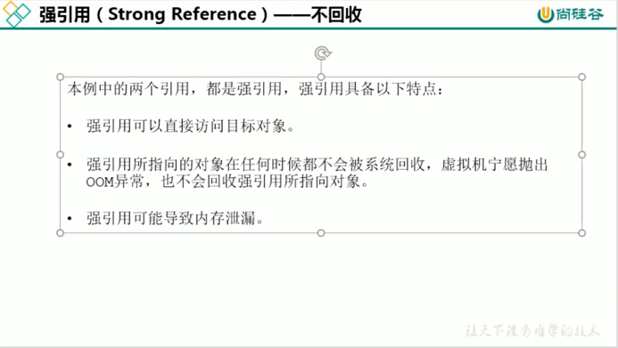
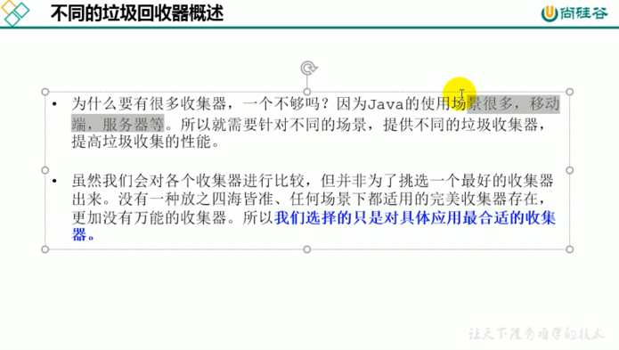

###并行与并发

###安全点(safePoint)和安全区域(safeRegion)
所有线程停顿下来等待GC
####安全点

####安全区域

####引用

强：永不回收

软：内存不足就回收，不一定要等到OOM

弱：发现就回收，发生GC就会回收

虚：对象回收跟踪

##垃圾回收器

###垃圾回收器发展

###Serial回收器：串行回收(新生代)

###ParNew回收器：并行回收(新生代)

###Parallel回收器：吞吐量优先(新生代)

