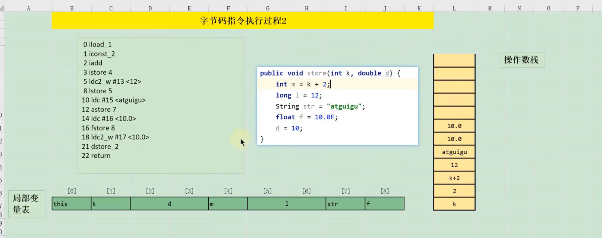

无符号数+表
####魔数
    验证是否是字节码文件
####Class版本号
    jdk1.8 52 高版本的虚拟机向下兼容，主版本号，副版本号
####常量池
    class文件的基石

字面量，符号引用

出栈装入局部变量表

###i++ ++i

i++后又把值赋值给原来的局部变量表
10  =>11   =>10

###返回是返回的部分 hello

###synchronize的底层

