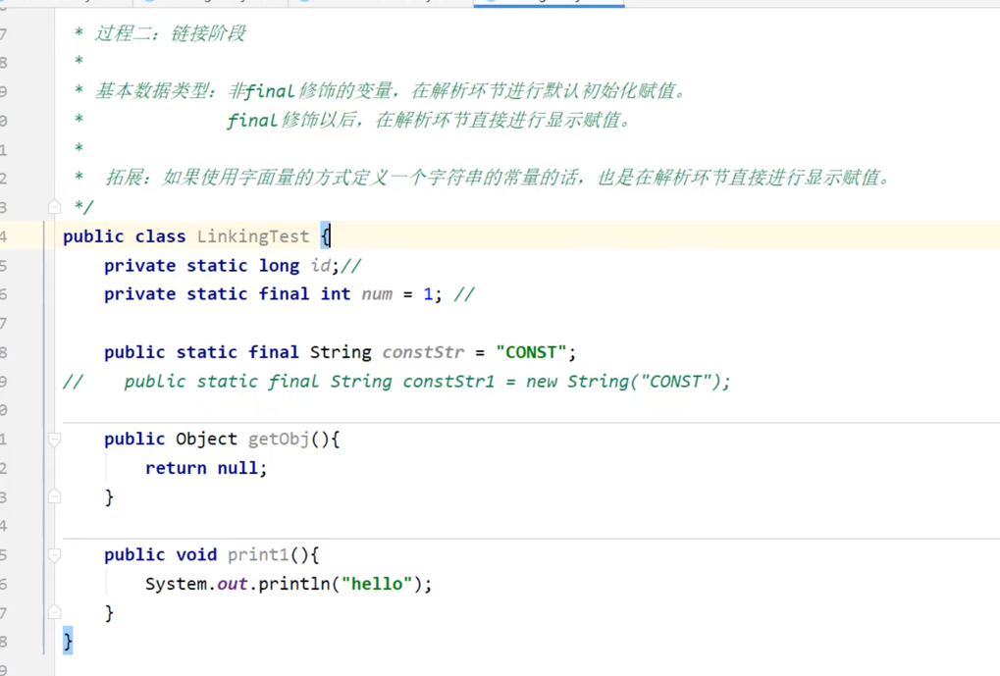
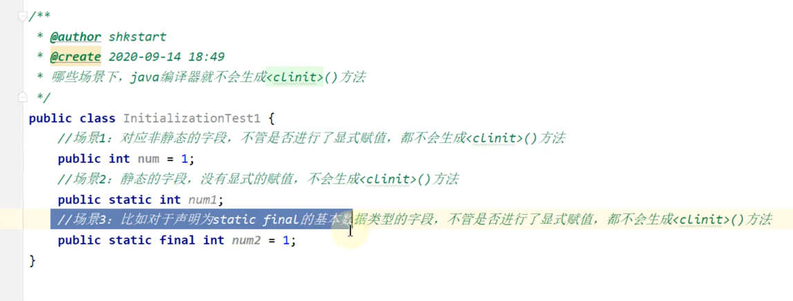
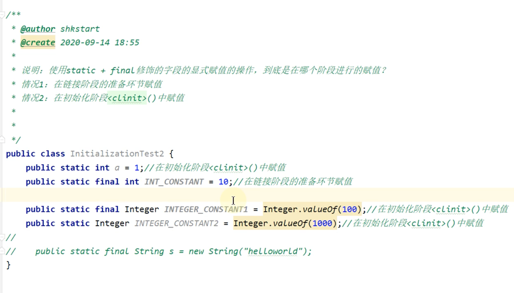
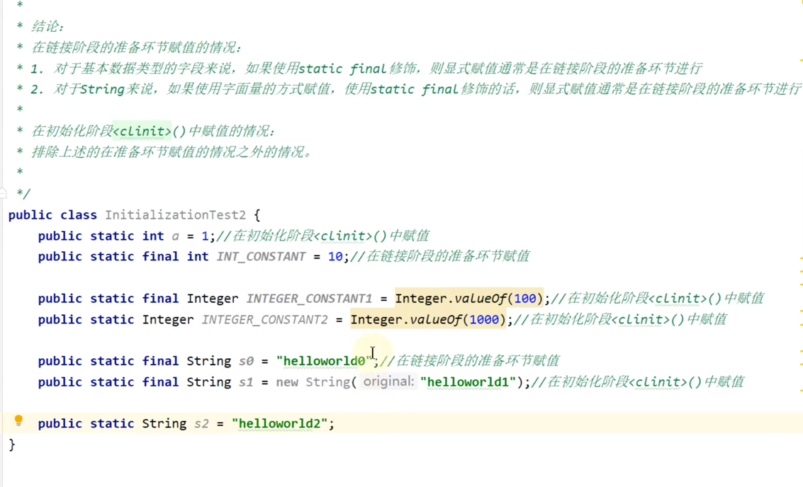

##那些场景下不会生成clinit方法

####主要在于能否提前确定下来
static+final修饰的基本数据类型，如果显示赋值没涉及到方法或者构造器返回的值，那么都是在链接的准备阶段赋值的
    private static final int a = new Random().nextInt(10)//在clinit初始化的时候赋值

loadClass和findClass，
内部loadClass会调用findClass,多出的代码就是双亲委派模型